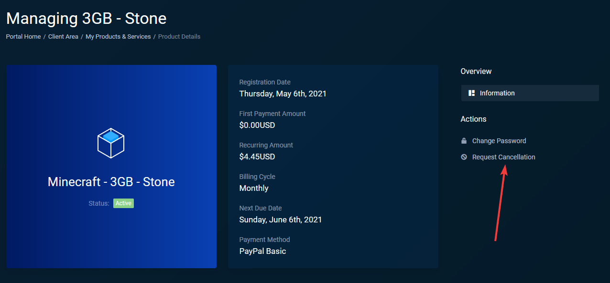
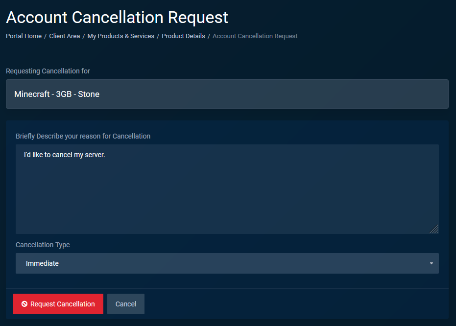

### Requesting a server cancellation

1. Sign into your [billing area](https://billing.aurorahosts.com) account.

2. Navigate to the [services page](https://billing.aurorahosts.com/clientarea.php?action=services)

3. Once you're on the product page select `Request Cancellation` on the right hand side.

4. On the cancellation page enter a reason for your cancellation and the type of cancellation. Outlined below is a brief description of both cancellation types

:::info Cancellation types
**Immediate**: An immidiate cancellation request will be processed at 00:00 UTC -5 ( America/Toronto )

**End of billing period**: An End of billing period request will be processed on your servers' next due date. You can view your due date by going to the [services page](https://billing.aurorahosts.com/clientarea.php?action=services)
:::

5. Once you've entered a reason and selected the type click the `Request Cancellation` button and you're done, your request will be processed according to the type of cancellation you picked.

:::note Want to void your request?
If you accidentily placed a cancellation request and need to void it please create a ticket in the [billing area](https://billing.aurorahosts.com)
:::