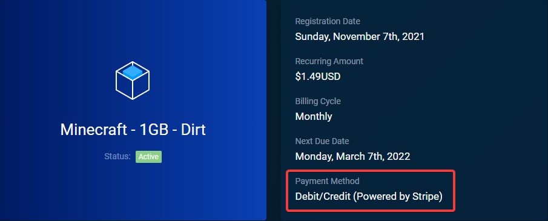

### Identifying the type of subscription

To identify the type of subscription you'll need to sign in to your [billing area](https://billing.aurorahosts.com) account. Once singed in click services, click on your service then on the side you'll see `Payment Method` if it shows PayPal click [here](#cancelling-a-paypal-subscription) if it shows Debit/Credit click [here](#cancelling-a-stripe-subsciption)

### Cancelling a PayPal subscription

1. Sign into your PayPal account

2. Click the gear icon at the top right.

3. Select Payments

4. Click Manage pre-approved payments

5. You'll see Aurorahosts as a merchant, click it and you'll see an option to cancel. Once cancelled you'll receive an email from PayPal.

### Cancelling a stripe subsciption

1. Sign in to the [billing area](https://billing.aurorahosts.com)

2. Click on your name at the top right

3. Select Payment methods

4. Find your card and click the delete icon.

5. Confirm the deletion