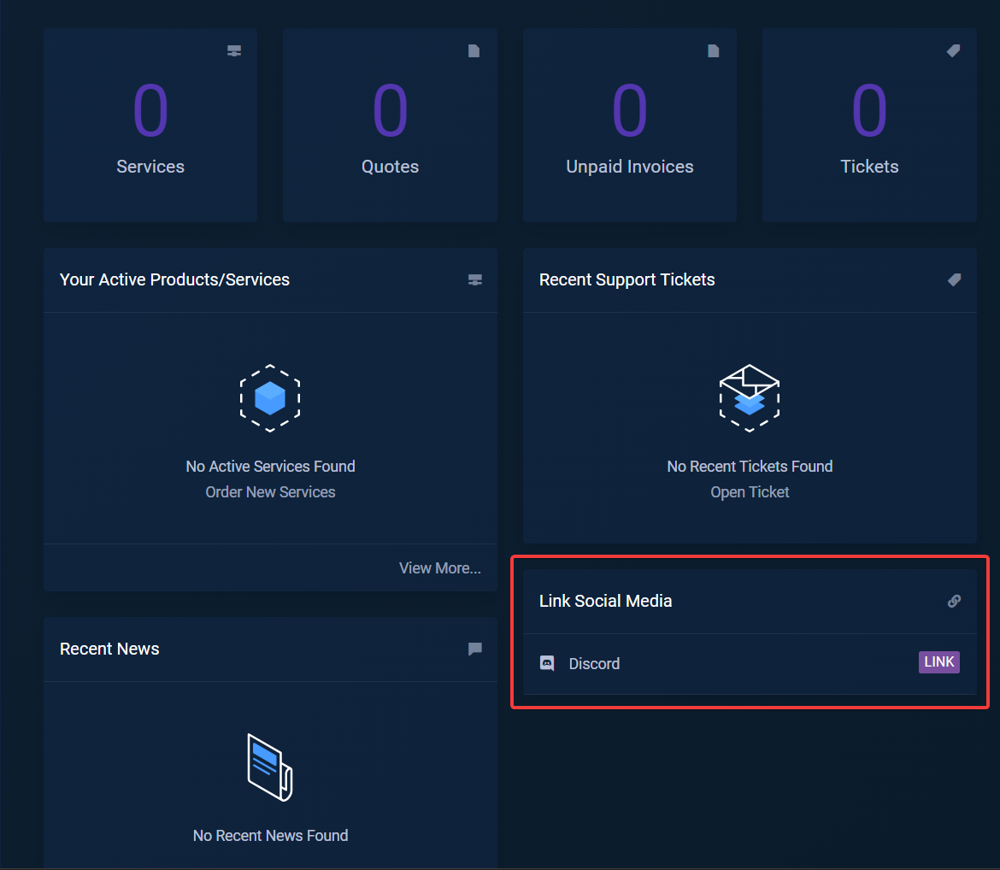
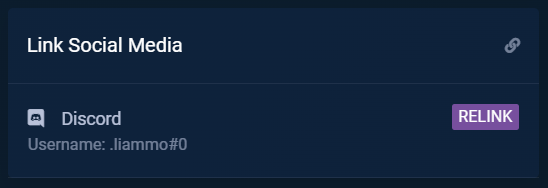

In this guide you'll find out how to obtain the client role in our discord by linking your discord account to our billing area.

## Getting started

1. Go to the [billing area](https://billing.aurorahosts.com/)

2. On the homepage you should see a **Link Social Media** section

3. Click **LINK** and you'll be redirected to the discord sign-in page.

4. After you've linked your account it should show your username in the **Link Social Media** section. If it does it means you've done everything correctly.

