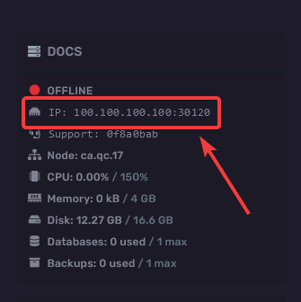
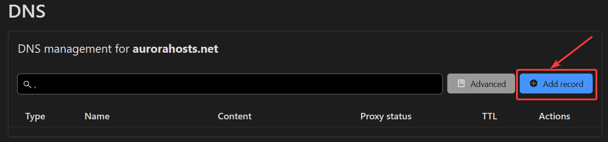
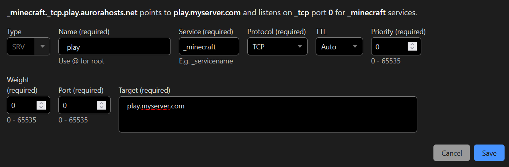
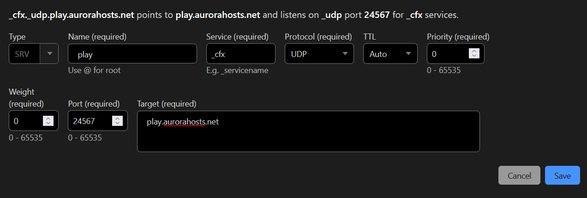

### Gathering information

To start off you'll need to identify your server IP. This can be found by looking at the console page of your game server.

You can copy the IP of your server by clicking anywhere within the IP field.

### Create an A record

For the purpose of this guide we'll be using cloudflare to create our A record, the process is practically the same for all other services such as Namecheap, Godaddy, porkbun etc...

After singing into your cloudflare account go to your domain, click `DNS` then click `Add record`.

You should be presented with the options to create the record. By default it'll select `A` as the type, to finish the setup you'll need to set the values for the `Name` and `IPv4 Address` fields.

* For the name field you can choose to put an `@` symbol to connect without any subdomain. If you wanted players to connect by using the subdomain `play` then you'd put `play` in the name field.
* For the `IPv4 Address` you need to place your servers' IP address which was copied in the first step.

:::warning Before saving
Before you save ensure you untick the the proxy status, it should say `DNS only`.
:::

Once you've filled in all the fields and ensured the proxy status is set to `DNS only` you can then save the record.

:::caution
After saving your record you may need to wait 10+ minutes before the DNS record has properly propagated.
:::
### Creating an SRV record (Optional)

Creating an SRV record may be required if you don't have a dedicated IP. The process for creating an SRV record is different for every game, specific values for certain games are listed below.

When creating an SRV record you'll be asked to enter a the desired values into the fields, outlined below is what you should place for these values:

#### Minecraft SRV record

* **Name**: play (View [name section](#name))
* **Service**: _minecraft
* **Protocol**: TCP
* **Priority**: 0
* **Weight**: 0
* **Port**: 23456 (View [port section](#port))
* **Target**: play.myserver.com (View [target section](#target))

Your record should look like this except with your desired values for the name and target. Your port should also be your server port, **not 2456**

#### FiveM SRV record

* **Name**: play (View [name section](#name))
* **Service**: _cfx
* **Protocol**: UDP
* **Priority**: 0
* **Weight**: 0
* **Port**: 23456 (View [port section](#port))
* **Target**: play.myserver.com (View [target section](#target))

Your record should look like this except with your desired values for the name and target. Your port should also be your server port, **not 2456**

##### Name
:::note Name
**Assuming you want players to connect using a subdomain such as `play.myserver.com` then place `play` in the name field.**
:::
##### Port
:::note Port
**Your server port can be found by looking at your IP, it'll be the 4-5 numbers followed by the colon.**
:::
##### Target
:::note Target
The target is determained by what you picked for the name field. We picked play so our target will be play.myserver.com
:::