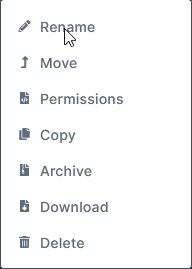
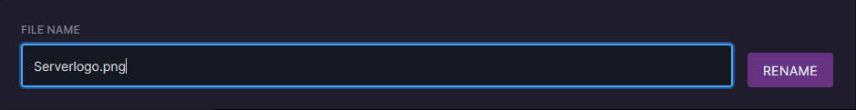

### Adding a logo to your server.

Adding a logo to your server sounds simple enough but there are some requirements that you may not have been aware of that will determine if your logo will work or not. All those requirements will be outlined below.

The following requirements are needed for your logo to function with your FiveM server.

* Logo must be in a .png format
* The logo size must be 96x96 no bigger or smaller.

If you have a logo and you want to verify the size a simple way to do this in Windows is by opening file manager, finding the logo, right click and select properties and a new window should pop up, once in that window click details then under the `Image` property you'll see Width and Height if they're both 96 then you logo meets the size requirements.

If your logo meets all the requirements listed proceed to the next step by clicking.

### Resizing your logo (Optional)

If the logo you'd like to use isn't already in 96x96 you can easily convert it by using online converters such as [Resizeimage.net](https://online-image-resizer.com/).

To start, upload your image by clicking `Upload an Image`

Once uploaded make sure the Width and Height are both set to `96`

After your image has fully uploaded and the Width and Hight are both set to 96 you can click `Resize Now`

Within a few moments the image should start downloading, and the result should be a smaller version of the uploaded image. Look at this tiny cat that'll soon be my logo 


:::warning Upload first!
Do not change the Height and Width of the image before uploading otherwise they'll reset after you upload the image.
:::

### Adding your logo.

If you have everything ready and your logo meets the requierments listed in the first section then you can now add your logo, to start you'll need to find and open the directory of your FiveM server where the `server.cfg` is located. On game servers the primary directory is shown by efault when clicking File manager, once you've found and opened the server directory you'll need to now upload the logo.

Once uploaded right click on the file in the game control panel and select rename.



Name it `Serverlogo.png`




After you've uploaded it you'll need to open your server.cfg and add the following:

```
load_server_icon Serverlogo.png
```

Once added restart your server and wait 1-5 minutes for the first heartbeat to be sent. Afterwards your new logo should show
