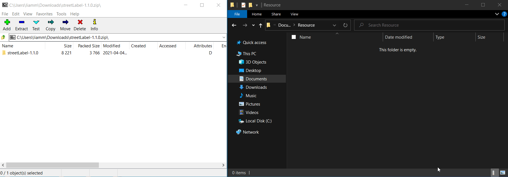
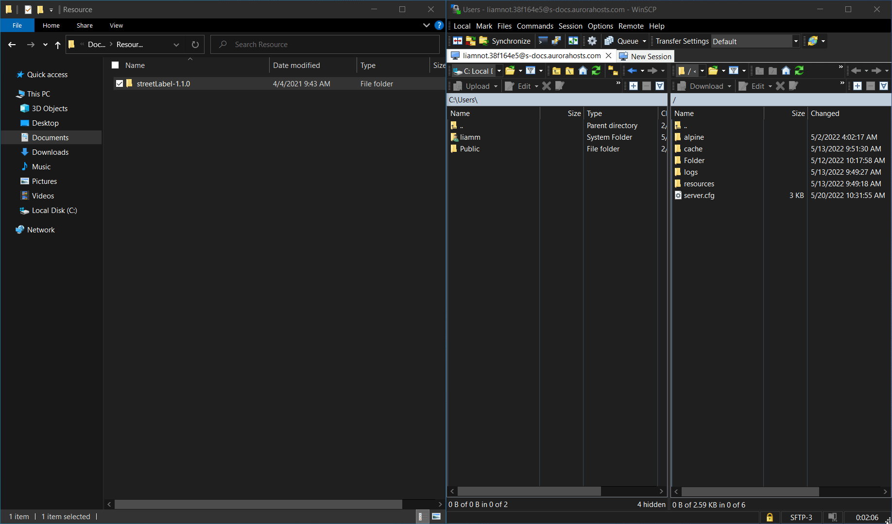
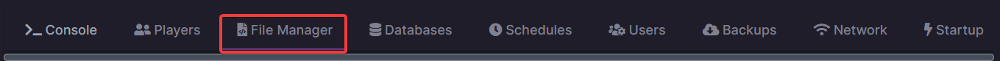
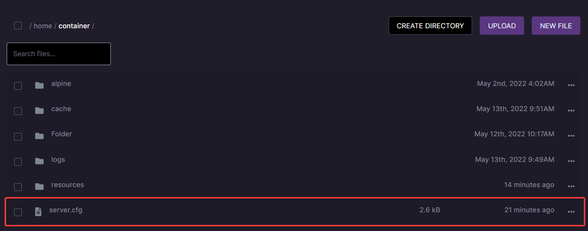
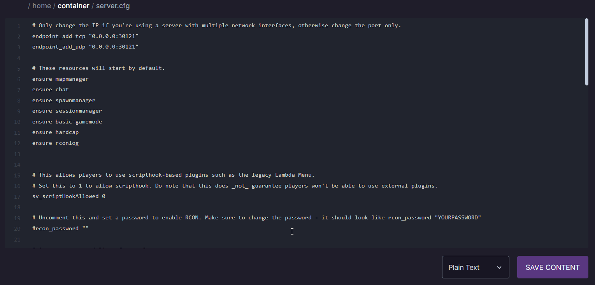
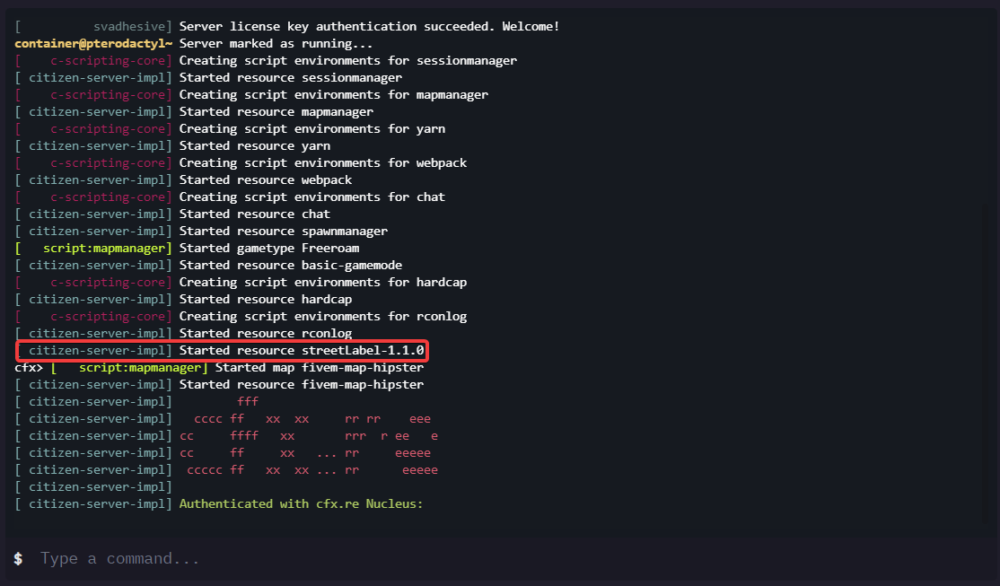

### Requirements
WinRAR or 7zip will be required to extract the resource files from the archive: [Winrar Windows download](https://www.win-rar.com/fileadmin/winrar-versions/winrar/winrar-x64-611.exe) - [7zip Windows download](https://www.7-zip.org/a/7z2107-x64.exe) 

Filezilla or WinSCP is required to upload your data to the server: [Filezilla Windows download](https://download.filezilla-project.org/client/FileZilla_3.59.0_win64_sponsored-setup.exe) - [WinSCP Windows download](https://winscp.net/download/WinSCP-5.19.6-Setup.exe)

:::info 
For the purpose of this guide we'll be using the street labels resource as the example resource. Download the resource by clicking [here](https://github.com/codibez/streetLabel/archive/refs/tags/v1.1.0.zip)
:::

### Extracting the resource

Once the resource is downloaded you need to extract the resource prior to uploading it to your server.

To extract the resource you'll need to have WinRAR or 7zip. Once you've opened the archive with the resource then you'll need to move the folder anywhere on your PC.

### Uploading the resource

After you've extracted the resource and placed it anywhere on your desktop you can then upload it to your server, to do this you'll need an SFTP client such as [Filezilla](https://download.filezilla-project.org/client/FileZilla_3.59.0_win64_sponsored2-setup.exe) or [WinSCP](https://winscp.net/eng/download.php)

After you've established a connection to your server with WinSCP or Filezilla you can upload the resource to your server, **If you don't know how to establish a connection to your server using WinSCP or Filezilla follow this guide [Uploading your files via SFTP](../Uploading%20files%20via%20SFTP.md)**

- To upload your resource you'll need to find the folder that you extracted earlier and then drag and drop it into the resources folder in WinSCP or filezilla.

### Starting the resource

Now that the resource has been uploaded to your server you'll need to start it before you can use it. To start it follow the steps below.

1. On the [game panel](https://gp.aurorahosts.com) go to the file manager tab on your server.

2. Open the server.cfg

3. Add the resource to the start list by adding `ensure resourcename` in our case `ensure streetLabel-1.1.0` anywhere in your server.cfg. Then click `Save content` or `CTRL + S` to save everything.

4. After you've started the resource in your server.cfg you can start your server and see if the resource started properly. **If the resource started properly you'll the output in the console would be `Started resource resourcename`**

:::info
Sometimes your server.cfg may not be in the main directory of your server, It can sometimes be located in the txAdmin base folder if you opted to use a txAdmin base. If that's the case you'll need to upload the resources to the resources folder located in that base folder and modify the server.cfg located in that base folder
::: 