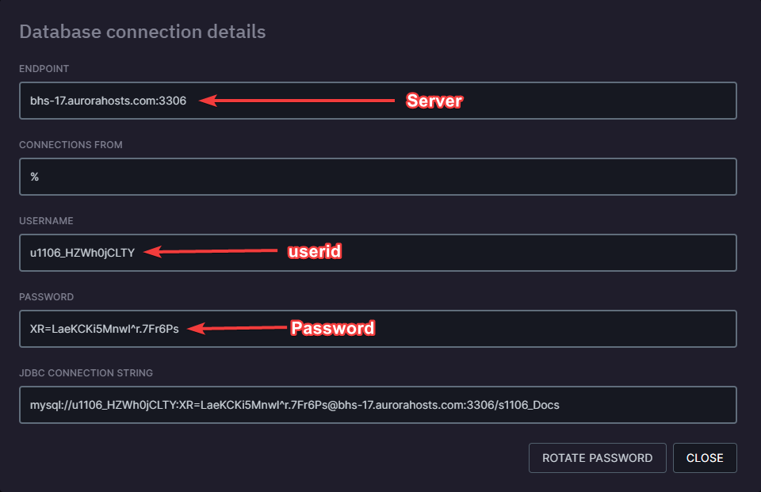

Some resources and frameworks may require you use a database to store data, in this guide you'll find out how to link your database to your FiveM server.

### Donlowading resources (optional)

To start you'll need to download the resource that allows your scripts to communicate with your database, the most common one is mysql-async-fivem which you can download [here](https://github.com/brouznouf/fivem-mysql-async/releases/). After downloading the resource follow the steps below

1. Once downloaded you'll need to add it to your resources, you can easily do this by either uploading the resource through the File manager or using any FTP client.

2. After uploading the downloaded archive to your resources folder you need to click the 3 buttons and click **Unarchive**. Afterwards a folder named `fivem-mysql-async` will pop up, you'll want to right click on the folder and click rename. Rename it to `mysql-async`, once it's been renamed you need to add it to your server.cfg so the resource will automatically be started when your server starts. If you don't know how to add it to the server.cfg follow the step below.

#### Ensuring the resource in your server.cfg

Your server.cfg is located in the main directory of your server (/home/container) once you've opened it add `ensure mysql-async` anywhere in your server.cfg. That's it! On next server startup the resource will be started.


### Connection strings

:::warning
Some frameworks may require a password without special characters, you can generate a password without special characters by clicking the details button (the eye) and then click `Change password.`

After you've clicked change password button a new box will pop up, make sure the checkbox for include special characters isn't checked.`

:::

Connection strings allow the mysql-async resource to establish a connection to your database. In the connection string details such as the database IP, database name, database username and password are included.

A connection string without any data looks like this:

```
set mysql_connection_string "server=;database=;userid=;password="
```

For mysql-async to establish a connection to your database you'll need to fill in the blanks with your database details.

As an example I'll use my database and fill in the blanks

To access these details go to the databases tab and click the eye icon.



Your database name can be found in the databases tab before clicking the eye to reveal more details.


With all the details we can fill in the blanks for our connection string. With the blanks filled in the connection string should look like this

```
set mysql_connection_string "server=bhs-17.aurorahosts.com;database=s1106_Docs;userid=u1106_HZWh0jCLTY;password=XR=LaeKCKi5Mnwl^r.7Fr6Ps"
```
:::warning
For the `server` portion **do not** include the port (:3306) only include the hostname/ip
:::

After you've filled in the blanks copy the entire connection string and add it to your server.cfg