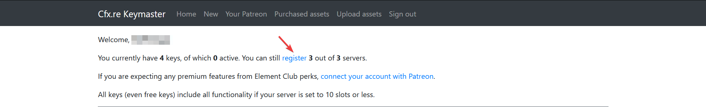

### Generating a license key

To start off you'll need to generate a license key, all FiveM servers require a license key to authenticate and start the server.

#### Step 1 -

Go to the FiveM [keymaster site](https://keymaster.fivem.net). Once there you'll be prompted to sign in through the FiveM fourms afterwards you'll be redirected to the page below. Once there click register

#### Step 2 -

After clicking the register button you'll be asked to enter the name of your key, the server IP, server type and provider. Below you can find what to put for each category.
* **Server IP**: Your server IP found in the game panel.
* **Server type**: VPS
* **Server provider**: NONE

Once done click the copy button to copy the key to your clipboard.

#### Step 3 -

Now that you've created and copied the key go back to the game panel and head to the startup tab, place the copied license key in the `FIVEM LICENSE` variable.

### Creating a steam API Key

Steam API keys are required for some resources, they're generally used to grab the STEAMID and Steam HEX ID of players.

#### Step 1 -

Go to the Steam API key website [here](https://steamcommunity.com/dev/apikey). Once there you'll be asked to sign in to your steam account.

#### Step 2 -

After signing in you'll be sent to the steam API key landing page, you'll be asked to enter a domain and agree to the terms of use. For the domain you can input anything.

:::caution Warning!
**You'll need to own at least one steam game to generate the key**
:::

Once generated copy the key and proceed to step 3.

#### Step 3 -

Now that you've copied the key head over to the game panel, go to the startup tab and place the key under the `STEAM API KEY` variable.

:::note Need help?
Join our discord, create a ticket 🙂
:::