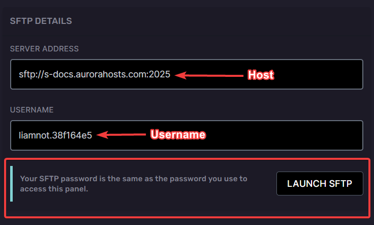
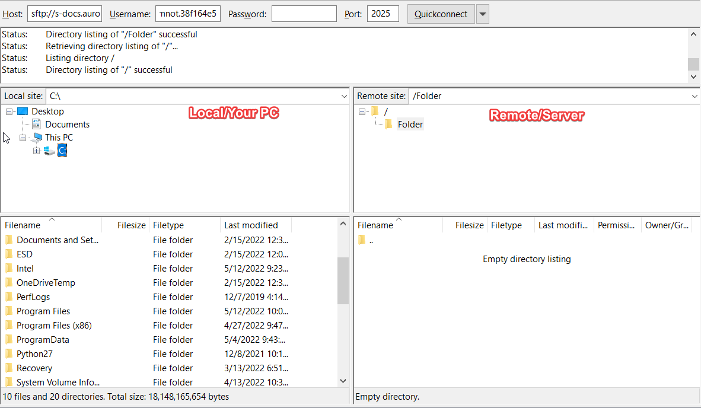
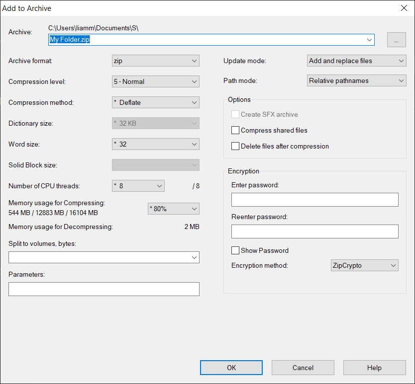
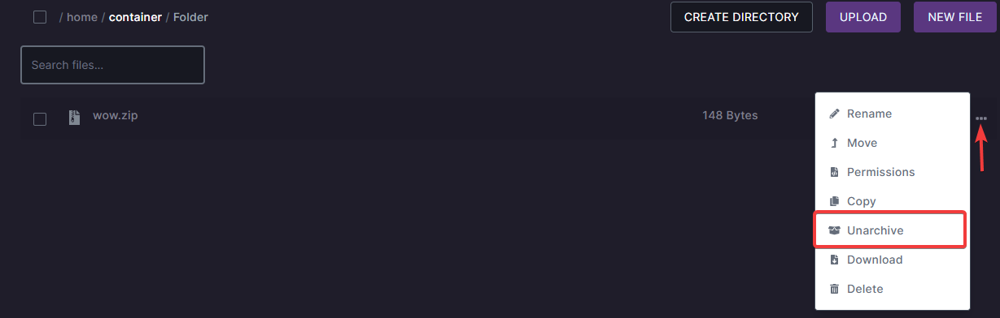

# Requirements
Filezilla or WinSCP: [Filezilla Windows download](https://download.filezilla-project.org/client/FileZilla_3.59.0_win64_sponsored-setup.exe) - [WinSCP Windows download](https://winscp.net/download/WinSCP-5.19.6-Setup.exe)
:::note
For the sake of this guide, we'll concentrate on WinSCP and Filezilla, but you can use any tool that supports SFTP connections.
:::
### Finding your details
To find your connection details you'll need to go to the settings tab of the game panel.

:::note
If you're a sub-user of the server ensure the owner has given you the correct permissions to use SFTP otherwise you won't be able to view your SFTP connection details
:::

In the settings tab you'll find `SFTP DETAILS`.

:::tip Using WinSCP?
If you have WinSCP you can click the `Launch SFTP` button, you'll only be asked to enter your password **which is the same as your game panel password.** 
:::

### Establishing a connecting with FileZilla/WinSCP:

Host field = `Server address`

Username field = `username`

Password = `Your game panel password`

Port = ` The port will be automatically entered when you click connect if you pasted the correct server address, if it doesn't then the port will always be 2025`

If everything is correct you'll be connected and you'll see the local side (Your PC) and the remote side (The server).

### Uploading data.

After connecting you can start uploading your data to the server. **When uploading data we recommend having your data archived, this can speed up the upload time of the data you're uploading as you're only uploading one thing. If you don't know how to create an archive follow the steps below.**

### Archiving your data

1. Ensure you have [7Zip](https://www.7-zip.org/download.html) or [WinRAR](https://www.win-rar.com/download.html?&L=0). For the purpose of this guide I'll be using 7zip.

2. Find the folder you want to archive. Right click the folder, select `7zip` then `Add to archive`.

3. A new window will popup, ensure the archive format is zip or tar then name the archive, afterwards click `OK` and the archive will be created.

4. Once the archive has finished compressing you can upload it to your server.

### Unarchiving your data

After you finished uploading the archive you created to your server you'll need to unarchive it, to do so follow the steps below.

1. Go to the **File manager** tab on the game panel.

2. Find the archive you uploaded.

3. Click the 3 dots and then `Unarchive`.

4. Once you've clicked unarchive you should see your data appear within a few minutes.

That's it you're done 🙂

:::info
**After clicking unarchive it may take a couple minutes to complete, if it's taking longer then expected create a ticket in our [discord](https://discord.gg/XxHx6PxwNn) and we'll help.**
:::