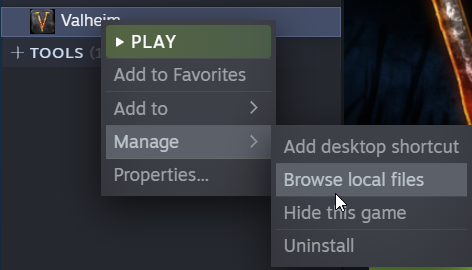

# Requirements

WinRAR or 7zip: [WinRAR Windows download](https://www.win-rar.com/fileadmin/winrar-versions/winrar/winrar-x64-611.exe) - [7zip Windows download](https://www.7-zip.org/a/7z2107-x64.exe)
Valheim

# Downloading ValheimPlus

1. Download ValheimPlus by [clicking here](https://github.com/valheimPlus/ValheimPlus/releases/download/0.9.9.8/WindowsClient.zip)

2. Locate your Valheim install location, to do this follow the instructions below:
   1. Open steam
   2. Locate Valheim
   3. Right click on Valheim
   4. Click Manage
   5. Click Browse local files

3. After locating and opening your Valheim install folder proceed to the next step

# Installing ValheimPlus

1. Open the downloaded archive "WindowsClient.zip"

2. Drag and drop everything from the "WindowsClient.zip" archive into the Valheim installation folder

# Checking the installation

To check if the install was successful open Valheim, a command prompt window should pop up. When the game is open you'll see a big PLUS below the Valheim logo.

:::warning Having problems installing?

If you're having any issues with installing the ValheimPlus client create a ticket in our [discord](https://discord.gg/XxHx6PxwNn)
:::