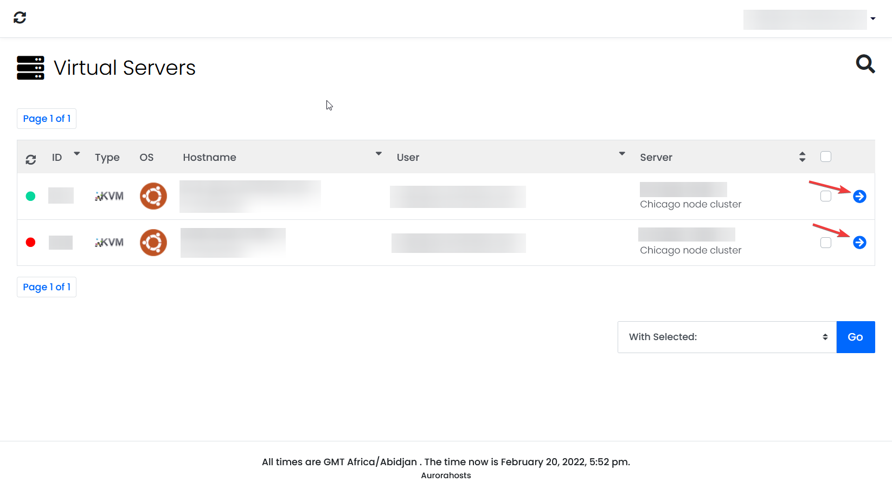
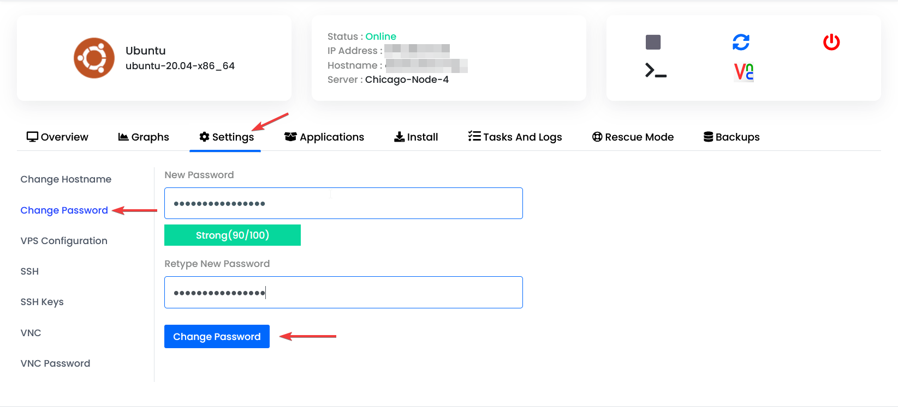

 ---
id: Change-Vps-Password
title: How to change your VPS password.
description: Changing the root password of your VPS
sidebar_position: 3
custom_edit_url: null
image: http://website-34k.pages.dev/img/logo/Aurorahosts2%20resize-02.png
---

By the end of this guide you'll have sucessfully changed your VPS password.

### Changing your root password.

#### Step 1.
To access the VPS control panel click [here](https://vps.aurorahosts.com)

#### Step 2.
Once you're signed in you'll see a list of your VPSs, click the little blue arrow.

#### Step 3.
After clicking the blue arrow click settings then Change password. Create a new passowrd and confirm it by clicking Change Password

:::caution
After you've sucessfully changed the password **you'll need to restart the VPS for the change to take effect.**
