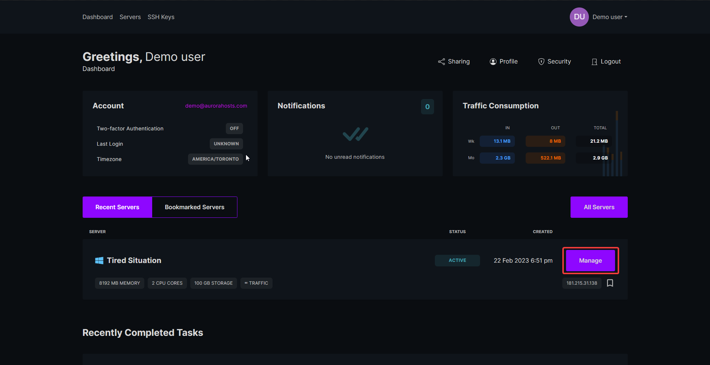
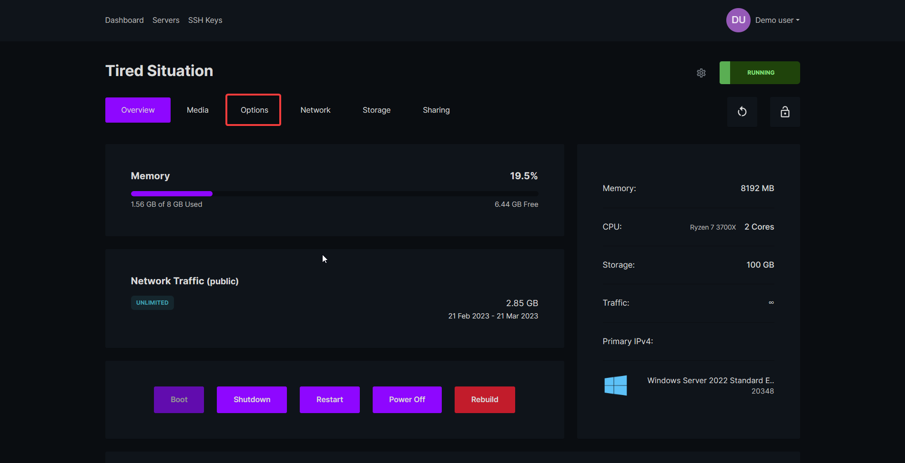
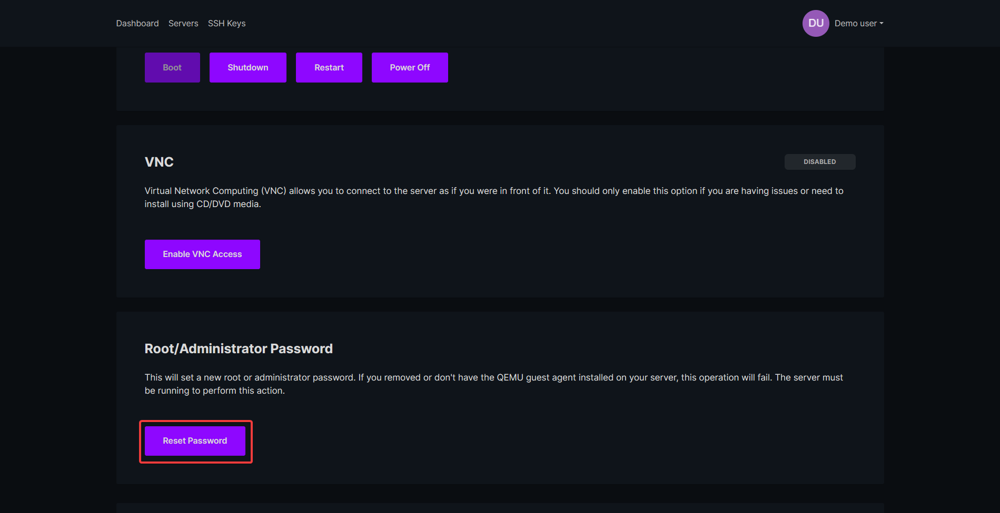
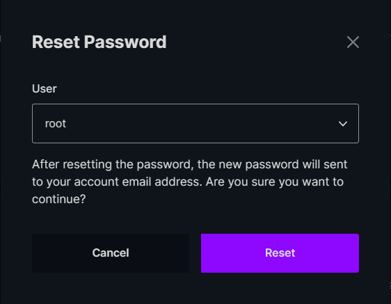
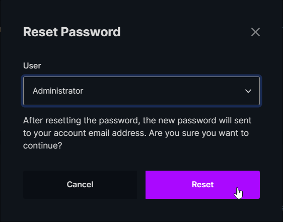

1. To get started you will have to login to the [VPS panel](https://virt.aurorahosts.com)

2. Once signed in go select your server

3. At the top click `Options`

4. Scroll down and select `Reset Password` in the Root/Administrator Password section

5. In the pop up you'll see two options after clicking the dropdown `root` and `Administrator`

:::tip Using Linux?
If you're using a Linux based OS (Debian, Ubuntu, CentOS etc...) select the `root` option.
:::

:::tip Using Windows?
If you're using Windows select `Administrator`, if you select root the password reset **will fail**
:::

---

:::info Still need help resetting your password?
If your VPS password reset is failing please create a ticket in the [billing area](https://billing.aurorahosts.com)
:::
