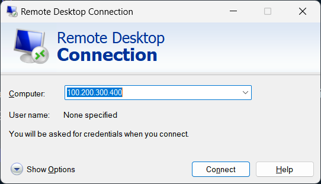
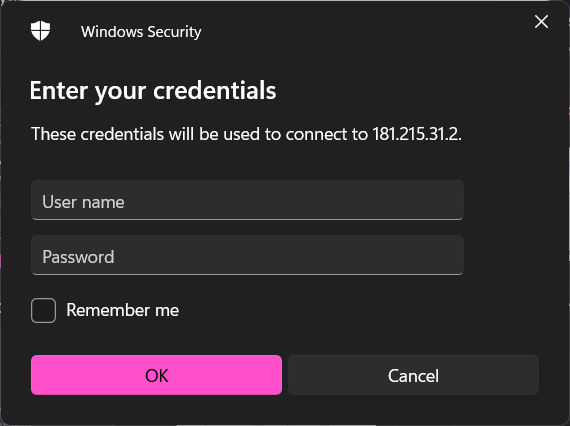
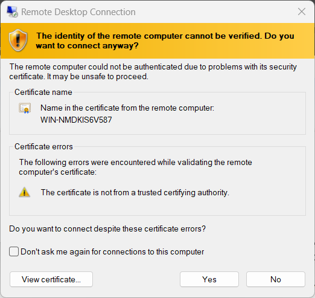

After setting up your VPS with Windows there are a few ways to connect to your machine.

## On Windows

If you're using a Windows machine by default you will have the Remote Desktop Connection app which
allow you to connect to any machine using the RDP protocol.

1. In the Remote Desktop Connection app you will see a field asking for the `Computer` in this field enter the IP of your VPS

2. After the IP is entered click `Connect` and a prompt asking for your credentials will show up.

>The default Windows server username is `Administrator`

3. You'll be prompted with a security warning, click `Yes` and then you're connected to your server

## On Mac

On MacOS the connection process is practically the same however you'll need to download the [Remote desktop app](https://apps.apple.com/us/app/microsoft-remote-desktop/id1295203466?mt=12) from the apple store