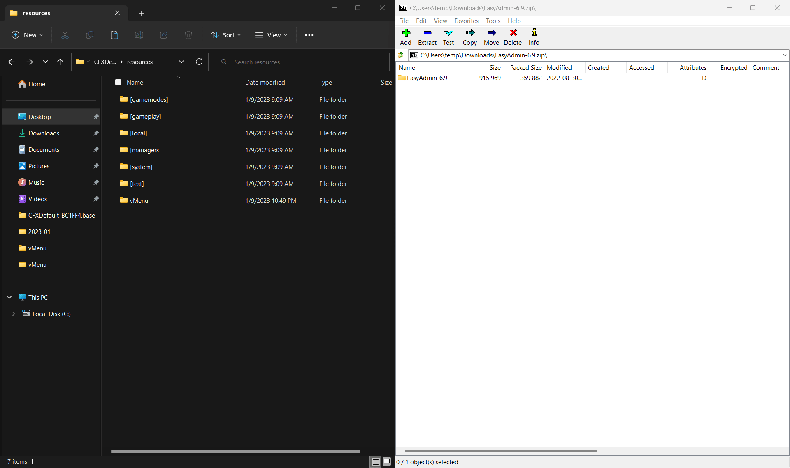

## What is EasyAdmin
EasyAdmin provides an easy-to-use interface that allows administrators to manage and monitor their servers,
including the ability to kick or ban players,
take screenshots of player's screens,
manage vehicles (spawn, delete, etc.)
in game and more. EasyAdmin is highly customizable,
and it can be integrated with other resources to add additional functionality to your server.

### Downloading EasyAdmin
1. Head over to the [EasyAdmin releases page](https://github.com/Blumlaut/EasyAdmin/releases/tag/6.91)
2. Find the latest version and click on `Source code (zip)`


### Adding EasyAdmin to your resources

With EasyAdmin downloaded you can now add it to your server.

1. Open the EasyAdmin download
2. Drag and drop the EasyAdmin-(version) folder into your resources folder
3. Rename the `EasyAdmin-(version)` to `EasyAdmin`


### Adding EasyAdmin to your server.cfg

Now that EasyAdmin is in your resources the last thing needed is to start it.

1. Open your server.cfg 
2. Add `ensure EasyAdmin` anywhere in your server.cfg


### Adding permissions and setting yourself as an admin

Before you're able to open the menu in game you'll need to add the permissions to your server.cfg along with adding yourself as an administrator.

1. Open your `server.cfg` and add the following to the bottom:
```editorconfig
add_ace group.moderator easyadmin.player.kick allow
add_ace group.moderator easyadmin.player.spectate allow
add_ace group.moderator easyadmin.player.teleport allow
add_ace group.moderator easyadmin.player.slap allow
add_ace group.moderator easyadmin.player.freeze allow

add_ace group.admin easyadmin.player.ban allow
add_ace group.admin easyadmin.player.kick allow
add_ace group.admin easyadmin.player.teleport allow
add_ace group.admin easyadmin.player.spectate allow
add_ace group.admin easyadmin.player.slap allow
add_ace group.admin easyadmin.player.freeze allow
add_ace group.admin easyadmin.player.ban.remove	allow
```
This sets specific permissions for Admins and moderator of the server, but EasyAdmin is very customizable and has other permissions that you can set for Admins or Mods. Find out more [here](https://easyadmin.readthedocs.io/en/latest/permissions/)

#### Adding yourself as an admin

With EasyAdmin you can add admins based on their linked Discord ID, steam, Xbox live or their rockstar license. For the purpose of this guide we'll be using the rockstar license but the process is the same for all other types of identifiers.

1. To find your Identifier go to your txAdmin control panel and click the `Players` tab.
2. In the players tab select yourself or the player you'd like to give permissions and click on them then click `IDs`
3. Copy the license without the `license:` portion. Ex: `6050ce2ecce20538cbaa7ca15089b308cbea2bd5`

4. Open your server.cfg and add the following at the bottom
```editorconfig
add_principal identifier.license:yourlicense group.admin
```
**Example:**
```editorconfig
add_principal identifier.license:6050ce2ecce20538cbaa7ca15089b308cbea2bd5 group.admin
```


:::tip Restart your server
After you've added yourself as an Admin you'll need to restart the server for any changes to take effect
:::

### Testing
If EasyAdmin was added correctly, upon a server restart you should see this in your server.cfg


**Lastly to open EasyAdmin in game  you'll need to configure the keybind in game as shown below**


---
<center><bold><h3>Thank you for reading</h3></bold></center>

<center>I hope this guide was helpful in assisting you with installing EasyAdmin on your server. If you're interested in finding more information on creating and customizing your FiveM server, be sure to check out the other guides in our knowledgebase.</center>
<br></br>
<center>Additionally if you're looking for a server provider, look no further Aurorahosts has got you covered with VPS's starting at $3.75 we've got the perfect plan for every server owner.</center> 
<center><a href="https://aurorahosts.com/vps">Get started today!</a></center>


