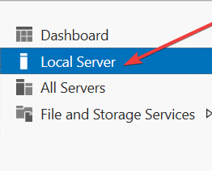
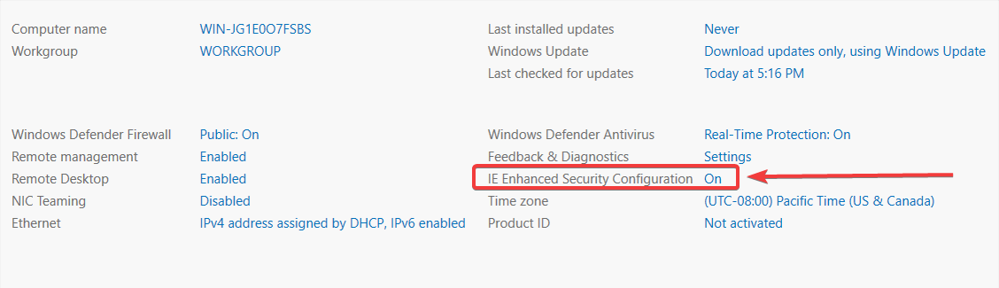
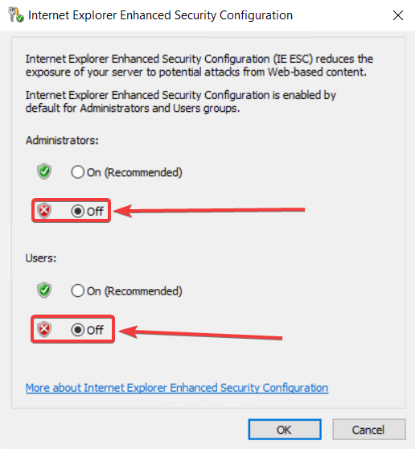

When using Internet explorer on your VPS you may encounter an error that says the content you're viewing is blocked by Internet Explorer Enhanced Security Configuration. In this guide you'll be shown how to disable the Enhanced Security Configuration.

### Disabling ESC

:::warning
Ensure internet explorer is closed before proceeding
:::

##### 1. In the search bar of your VPS type `Server manager`

##### 2. Open server manager, on the left side you'll see the option for `Local server`

##### 3. Find IE Enhanced Security Configuration and click `On`

##### 4. The configuration window will pop up, ensure that both options are set to `Off` then click OK.

:::info You're done!
If you've reached the end and you've followed all the steps and you're still unable to download or visit websites then please contact our support through [discord](https://discord.gg/XxHx6PxwNn) or through the [billing area](https://billing.aurorahosts.com)
:::