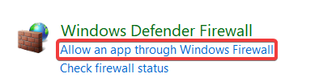
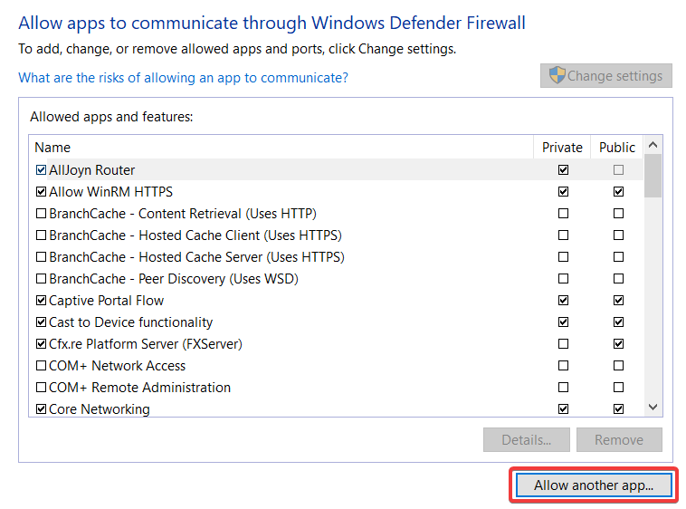
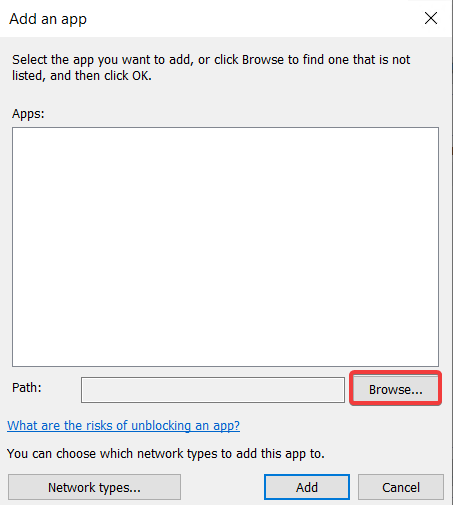
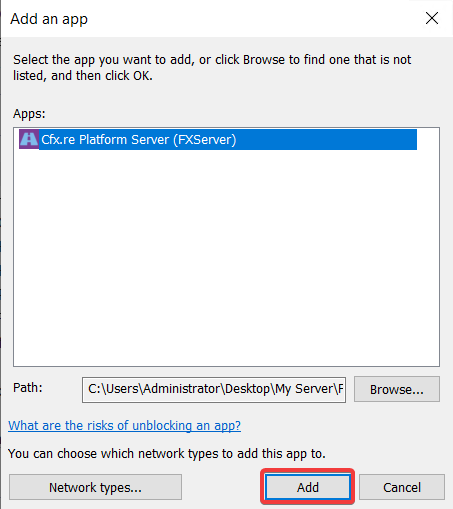
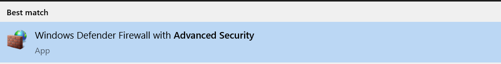
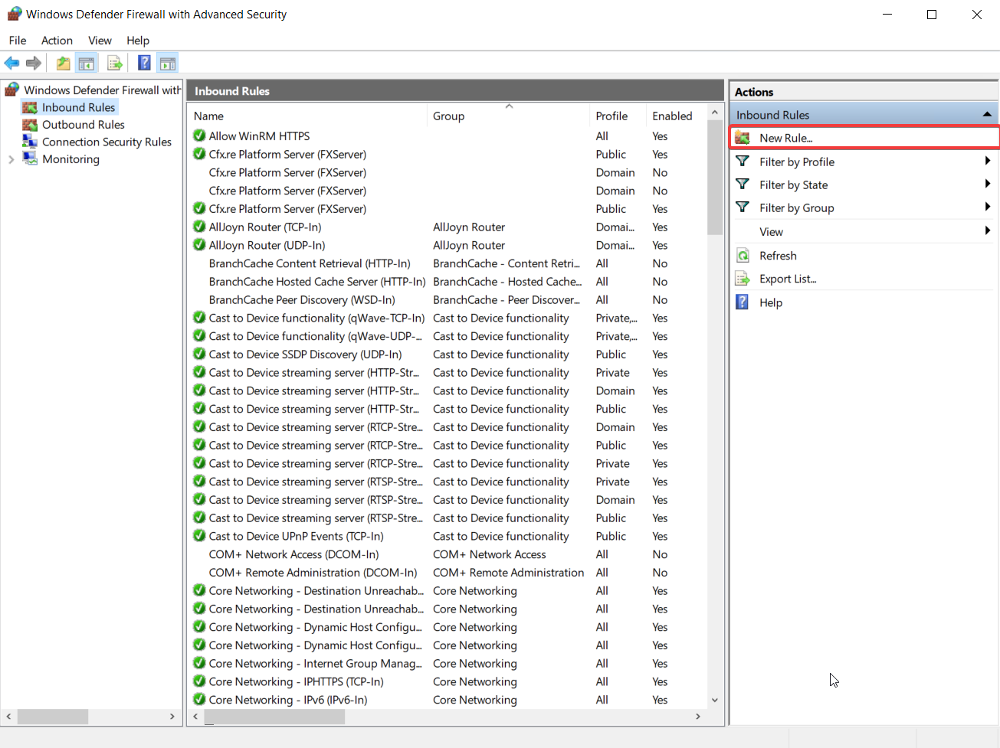
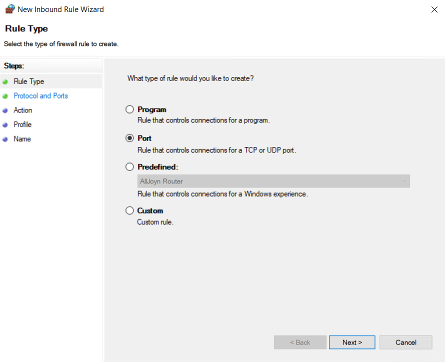
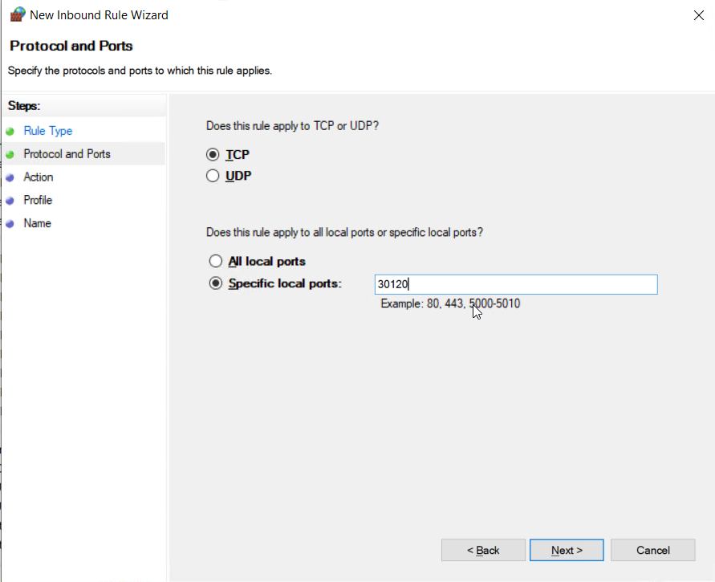
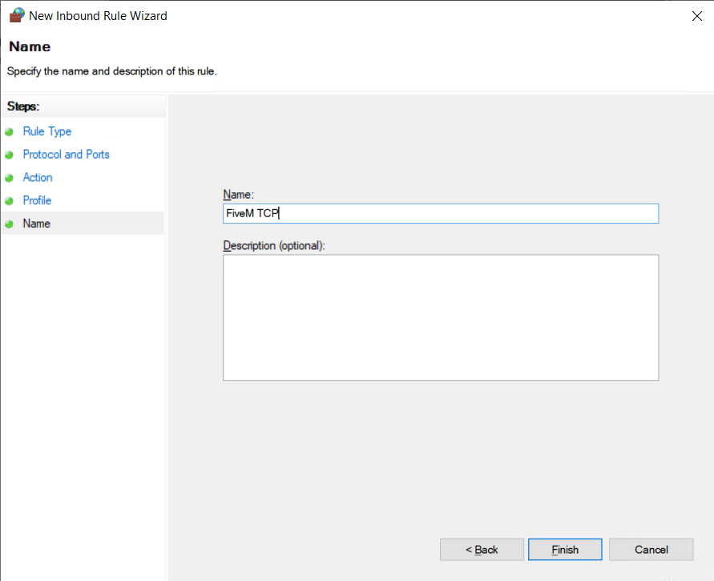

In this guide 2 methods will be shown to port forward. Port forwarding by allowing the application through the firewall and port forwarding by allow incoming connections to a specific port.

## Method 1
In method 1 we'll cover how you can port forward by allowing the application through the Windows firewall.

1. Open the control panel and lookup `Firewall` and click on `Allow an app through the Windows Firewall`

2. In the Allowed apps section click on `Allow another app`

3. Click on `Browse` and find the application you want to port forward, in this example we'll be allowing the FiveM application by adding the `FXServer.exe` application to the allowed list of applications, the `FXServer.exe` application can be found in the directory where your server artifacts are located

4. After you've selected the application you want to port forward click `Add`

## Method 2
In method 2 we'll cover how to port forward by allowing connection to a specific port through the Windows firewall

1. In the Windows search bar lookup `Advanced Security` and click on `Windows Defender Firewall With Advanced Secuirty`

2. In the `Windows Firewall` click on `Inbound rules` then click `New rule` on the right side.

3. In the type section select `Port`

4. Select either `TCP` or `UDP` depending on the application. In this case we're port forwarding a FiveM server so we'll to create one TCP rule and one UDP rule for port `30120`

    In the Action and profile section click next.

5. Lastly you will need to name this rule, the name can be anything but to keep track of the rules created we're going to name it `FiveM TCP`

:::info
For applications that accept both TCP and UDP connection you'll need to create a second rule for UDP otherwise the connections to the application may be denied.
:::