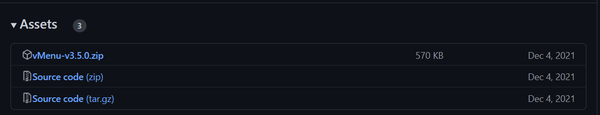
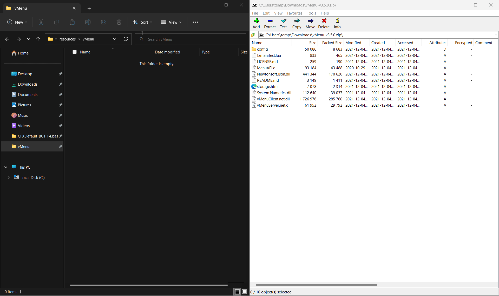
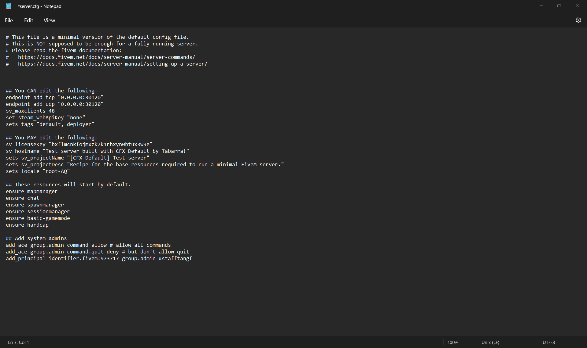
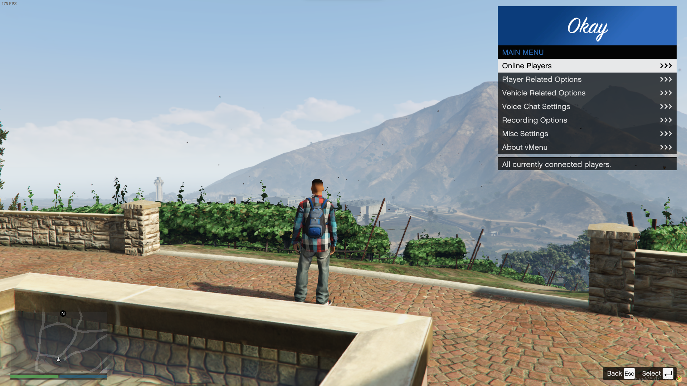

## What is vMenu?
vMenu is a custom server-side trainer/menu a modification. 
vMenu allows server administrators to easily configure and customize their servers, 
as well as give players on their servers the ability to perform various actions, 
such as spawning vehicles, teleporting, and more. 
The vMenu menu can be accessed in-game by clicking the `M` key, 
and it allows players to access various options and features that are configured by the server administrator.

### Downloading vMenu

1. Head over to the [vMenu releases page](https://github.com/TomGrobbe/vMenu/releases)

2. Click the option at the top labeled vMenu-v(version).zip

### Adding vMenu

With vMenu downloaded you can now add it to your server.

1. Open your resources folder and create a new folder named `vMenu`
2. Drag and drop the contents of the vMenu-v(version).zip into the `vMenu` folder
   
3. Go to the `config` folder and drag the `permissions.cfg` to the same folder in which your `server.cfg` is located.

#### Adding vMenu to your server.cfg

Lastly before you can use vMenu you need to ensure that it's started in your server.cfg.

1. Open your `server.cfg` and add `ensure vMenu` anywhere in your `server.cfg`
2. Add `exec permissions.cfg` at the top of your server.cfg

:::note
**If the `permissions.cfg` isn't in the same folder as your server.cfg your server will not be able to load the `permissions.cfg`**
:::

### Testing

If your server console shows vMenu has started without any permission errors then you've likely added it correctly.

To check if you have added it correctly **connect to your FiveM server and use the `M` button to see if vMenu opens.**

**If vMenu was added properly it should open when you click `M` in-game.
If it does not open check your server console to see if vMenu was properly started and if it produced any errors.**

---

<bold><h3>Thank you for reading</h3></bold>

I hope this guide was helpful in assisting you with installing vMenu on your server. If you're interested in finding more information on creating and customizing your FiveM server, be sure to check out the other guides in our knowledgebase.

  

Additionally if you're looking for a server provider, look no further Aurorahosts has got you covered with VPS's starting at $3.75 we've got the perfect plan for every server owner.
 

<a href="https://aurorahosts.com/vps">Get started today!</a>

